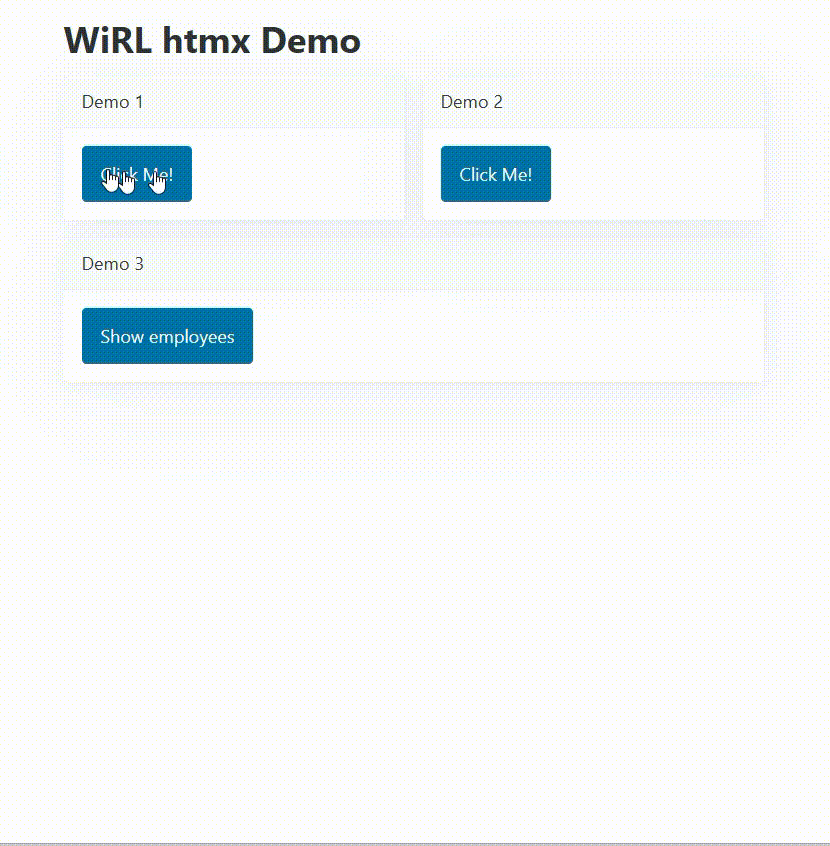

# WebStencilsDemo

**WebStencilsDemo** is a [Delphi](https://www.embarcadero.com/products/delphi) project that demonstrates how to use a custom message body writer with WiRL to create an [HTMX](https://htmx.org/)-powered application. This project showcases the integration of [WiRL](https://github.com/delphi-blocks/WiRL), a Delphi library for developing REST applications, with HTMX, leveraging a new Delphi component called [WebStencils](https://blog.marcocantu.com/blog/2024-september-introducing-webstencils.html) for HTML generation through templates.

## Prerequisites

- Delphi >= 12.2 (WebStencils component)
- [WiRL library](https://github.com/delphi-blocks/WiRL)

## License

This project is licensed under the Apache License - see the [LICENSE.md](LICENSE.md) file for details.

